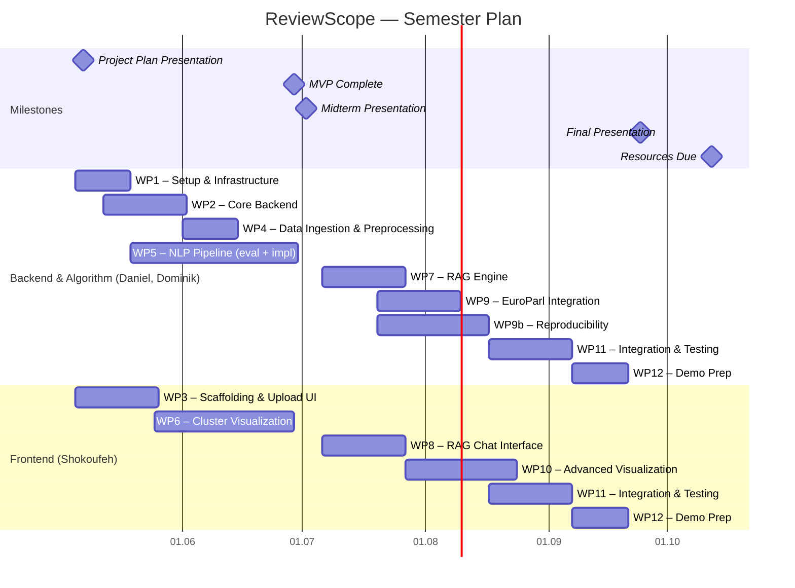

# Project Plan — ReviewScope

**Team:** Daniel (Backend/Algorithm), Dominik (Backend/Algorithm), Shokoufeh (Frontend)  
**Capacity:** 8h/week per person  
**Development approach:** Backend/Algorithm and Frontend run in parallel throughout the project.

---

## Milestones

| # | Milestone | Date |
|---|---|---|
| M1 | Project Plan Presentation | 07.05.2026 |
| M2 | MVP complete (Yelp pipeline → visualization) | 29.06.2026 |
| M3 | Midterm Presentation | 02.07.2026 |
| M4 | Final Presentation | 24.09.2026 |
| M5 | Project Resources Due | 12.10.2026 |

---

## Work Packages

| WP | Title | Owner | Phase |
|---|---|---|---|
| WP1 | Project setup & infrastructure (repo, Docker Compose, CI/CD) | Daniel, Dominik | MVP |
| WP2 | Core backend (FastAPI, DB schema, Celery + Redis) | Daniel, Dominik | MVP |
| WP3 | Frontend scaffolding & upload UI | Shokoufeh | MVP |
| WP4 | Data ingestion & preprocessing (Yelp) | Daniel, Dominik | MVP |
| WP5 | NLP pipeline — method evaluation & implementation: candidate methods (embedding models, dimensionality reduction: UMAP/PCA/t-SNE, clustering: HDBSCAN/hierarchical/KMeans, LLM labeling) to be benchmarked and selected empirically before implementation | Daniel, Dominik | MVP |
| WP6 | Cluster visualization (2D/3D scatter, cluster detail view) | Shokoufeh | MVP |
| WP7 | RAG engine (prompt design, context injection, orchestration) | Daniel, Dominik | Phase 2 |
| WP8 | RAG chat interface (streaming, follow-up queries) | Shokoufeh | Phase 2 |
| WP9 | EuroParl integration (ingestion, multilingual pipeline) | Daniel, Dominik | Phase 2 |
| WP9b | Stable & incremental clustering — two goals: (1) deterministic re-runs (same corpus → same clusters, via seed management, parameter versioning, approximation investigation); (2) incremental updates (new documents added to existing clusters without full re-run, meaningful cluster identity stability across runs) | Daniel, Dominik | Phase 2 |
| WP10 | Advanced visualization (time series views — depends on WP9b) | Shokoufeh | Phase 2 |
| WP11 | Integration, testing & hardening | All | Phase 2 |
| WP12 | Demo preparation & final polish | All | Final |

---

## Gantt Chart

---

## Phase Summary

### MVP — May to end of June
Goal: working end-to-end pipeline on the Yelp dataset, visible in the browser.

Backend/Algorithm and Frontend run in parallel:

**Backend/Algorithm (Daniel, Dominik):**
- Infrastructure, CI/CD, Docker Compose
- FastAPI backend, PostgreSQL + pgvector, Celery + Redis
- Yelp ingestion and preprocessing
- NLP pipeline: benchmark and select methods (embedding model, dimensionality reduction, clustering algorithm), then implement and integrate

**Frontend (Shokoufeh):**
- Component scaffolding, routing, file upload UI
- Interactive 2D/3D cluster scatter plot and cluster detail view

### Phase 2 — July to mid-August
Goal: RAG chat, EuroParl support, advanced visualization.

**Backend/Algorithm (Daniel, Dominik):**
- RAG engine with orchestration framework; prompt and context strategy
- EuroParl corpus ingestion; multilingual embedding evaluation
- Stable & incremental clustering (WP9b): two goals — (1) deterministic re-runs so the same corpus always produces the same clusters; (2) incremental updates so newly arriving documents can be meaningfully added to existing clusters without triggering a full re-run. Both require investigating approximation methods and cluster identity stability. Hard problem, high value — prerequisite for time series visualization.

**Frontend (Shokoufeh):**
- Streaming RAG chat interface
- Time series visualization (WP10) — scheduled in parallel with WP9b; meaningful only once reproducibility is in place

### Final — mid-August to September 24
Goal: stable, demo-ready application.

- Full-stack integration testing
- Performance and UX hardening
- Demo script and final presentation preparation

---

## Possible Extensions

Features beyond the core project scope, to be tackled if time allows after the MVP and Phase 2 are complete:

- **Time series analysis** — track how themes evolve over time across a corpus with temporal metadata. Targeted for Phase 2 (WP10), contingent on reproducibility (WP9b) being completed first.
- **Multilingual support** — extend the pipeline to handle multilingual corpora natively (e.g. EuroParl in multiple languages), requiring evaluation of multilingual embedding models
